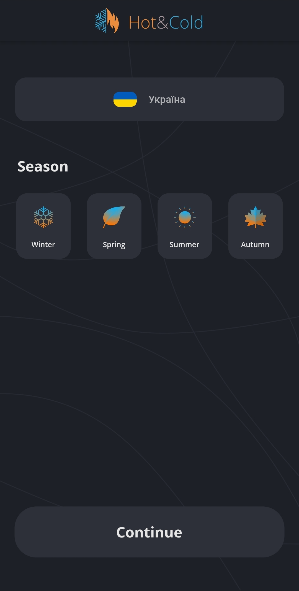
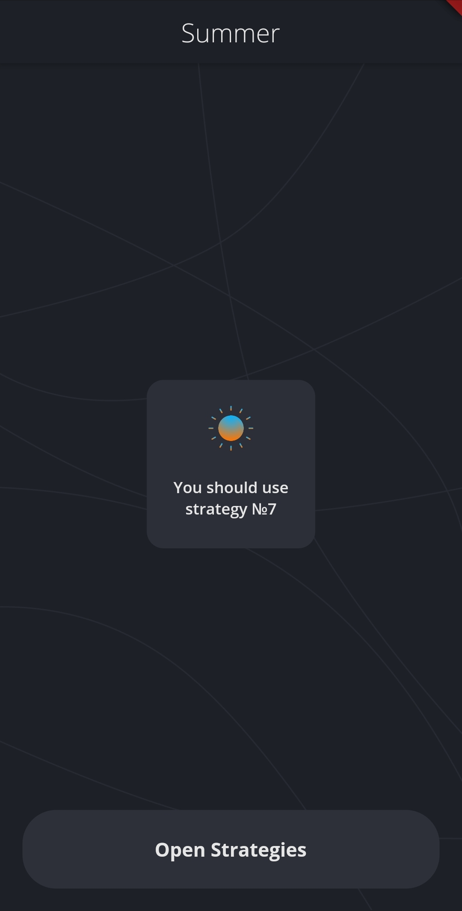
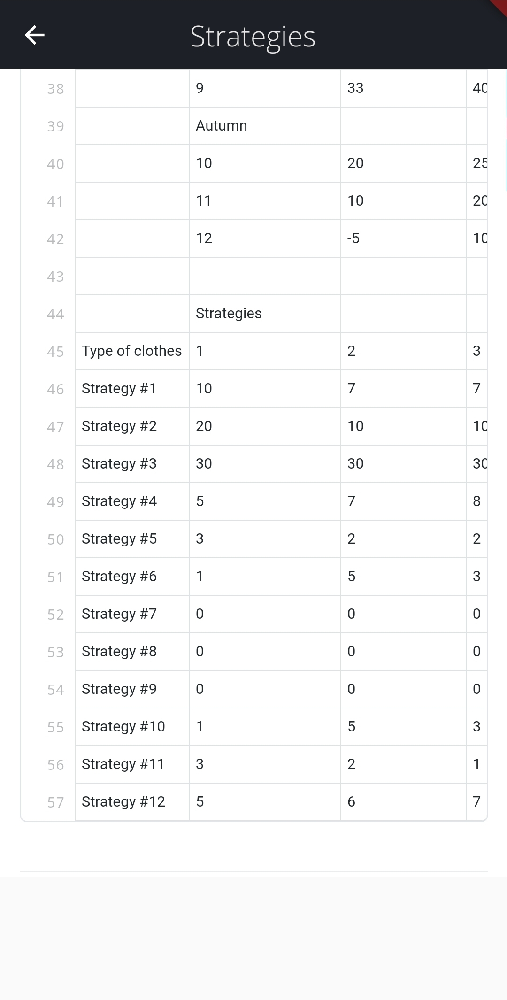

# Hot&Cold

[![Build Status][travis-image]][travis-url]

The project allows you to determine the most profitable tailoring of clothes in the selected season



## Installation

Android:

```open hotcold.apk```

## Usage example

For example, let's choose summer. Next, click on the "Continue" button. Then we will see the second screen.



The number of the strategy to be selected will be written on it. By clicking on the button below, you can see the available strategies.



## Release History

* 0.2.0
  * ADD: Add `WebView strategies`

* 0.1.1
  * FIX: Crash when calling `_makeGetRequest()` 

* 0.1.0
  * The first proper release

* 0.0.1
  * Work in progress

## Meta

Lebedyntsev Nikita – [@Amanell](https://t.me/Amanell) – Telegram

Rubin Efim – [@fimacom](https://t.me/fimacom) – Telegram

Solovinska Yevheniia -  [@jansool](https://t.me/jansool) - Telegram

## Contributing

1. Fork it (<https://github.com/Anti-Alpha/Hot-Cold/fork>)

2. Create your feature branch (`git checkout -b feature/Hot_Cold`)

3. Commit your changes (`git commit -am 'Add some HOTS'`)

4. Push to the branch (`git push origin feature/Hot_Cold`)

5. Create a new Pull Request


[npm-image]: https://img.shields.io/npm/v/datadog-metrics.svg?style=flat-square
[travis-image]: https://img.shields.io/travis/dbader/node-datadog-metrics/master.svg?style=flat-square
[travis-url]: https://travis-ci.org/dbader/node-datadog-metrics
[wiki]: https://github.com/yourname/yourproject/wiki